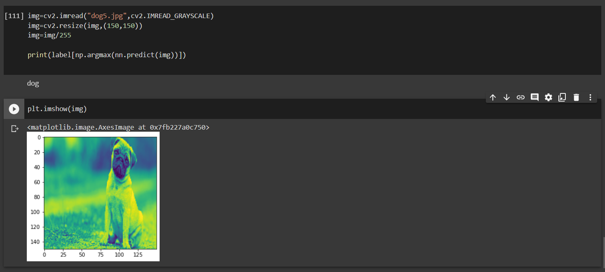
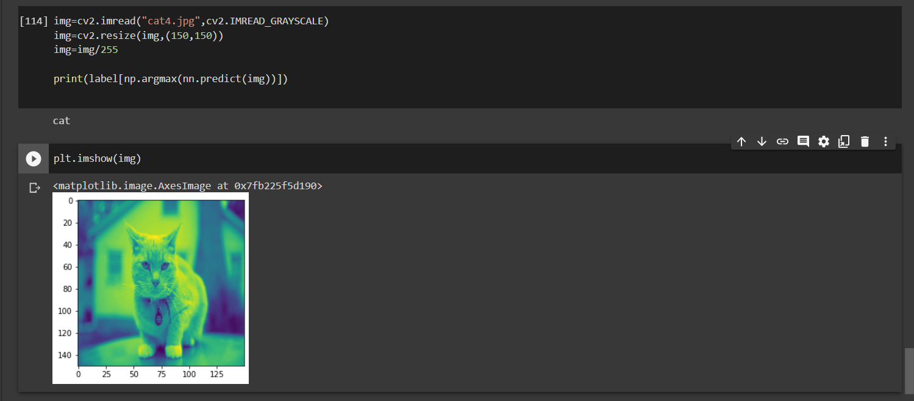

# Computer-Vision-based-Web-App

This is a machine learning model that predicts whether the input image is a cat or a dog using tensorflow.keras in python.
The following table shows the training summary for different models in tensorflow.keras .

| Model | Architecture(number and size of filters) | Epochs | acc | loss | val\_acc | val\_loss |
| --- | --- | --- | --- | --- | --- | --- |
|Without MaxPool2D layer	|15,3	|15	|1	|0.0027	|0.636	|1.1892|
|	  |16,4	|15	|1	|7.68E-04	|0.63	|1.5135|
|	  |24,3	|10	|1	|0.0018	|0.637	|1.3047|
|With 1 MaxPool2D layer 	|64,3	|10	|0.9999	|0.1019	|0.691	|1.15|
|	  |32,3	|13	|1	|0.0027	|0.684	|1.3229|
|	  |8,3	|20	|1	|0.0025	|0.698	|1.2637|	
|With 3 MaxPool2D layers	|16,3	 |25 |0.9979	|0.0389	|0.704	|1.3593|
|   |8,3	|25	|0.9065	|0.229	|0.685	|1.1065|

A few of detection test results are given below:

