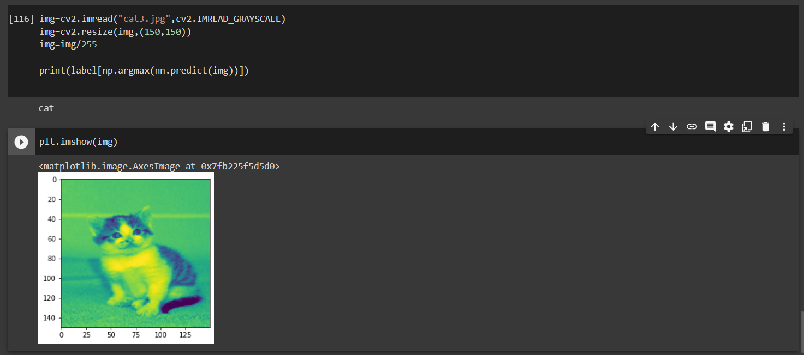

# Computer-Vision-based-Web-App
This is one of the projects being done under the hood of Summer of Code '21 by WnCC, IIT Bombay. The objective of this project is to make a web app that can perform object detection and data analysis using tensorflow, opencv, yolo, faster-cnn and python.

The following table shows the training summary for different models in tensorflow.keras which is being trained to distinguish between cat and dog images.

| Model | Architecture(number and size of filters) | Epochs | acc | loss | val\_acc | val\_loss |
| --- | --- | --- | --- | --- | --- | --- |
|1	|64,3	|10	|0.9999	|0.1019	|0.691	|1.15|
|	|32,3	|13	|1	|0.0027	|0.684	|1.3229|
|	|8,3	|20	|1	|0.0025	|0.698	|1.2637|	
|2	|15,3	|15	|1	|0.0027	|0.636	|1.1892|
|	|16,4	|15	|1	|7.68E-04	|0.63	|1.5135|
|	|24,3	|10	|1	|0.0018	|0.637	|1.3047|
|3	|15,4	|15	|1	|0.0048	|0.691	|1.4803|
|	|8,3	|15	|1	|0.0074	|0.672	|1.5763|

A few of detection test results are given below:

