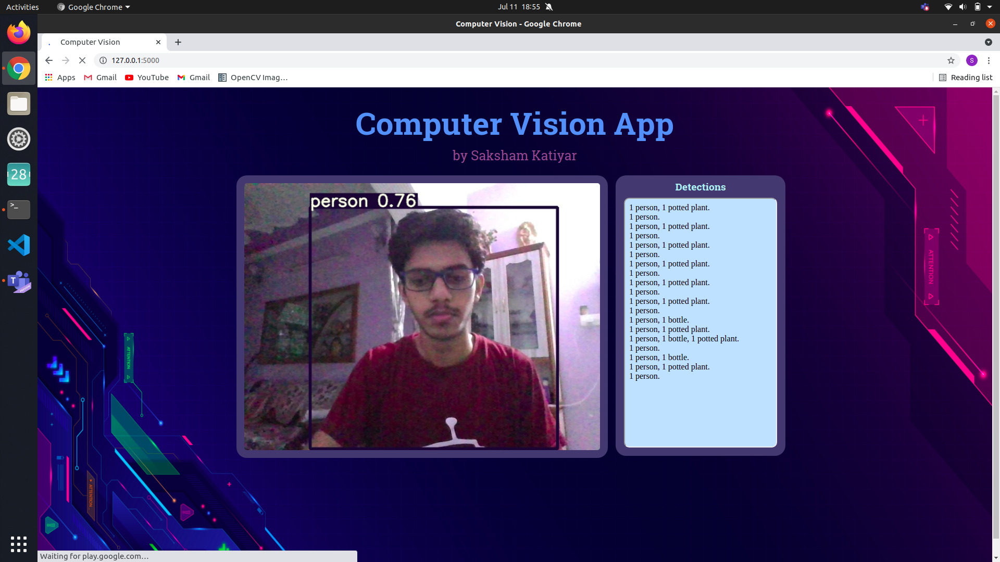
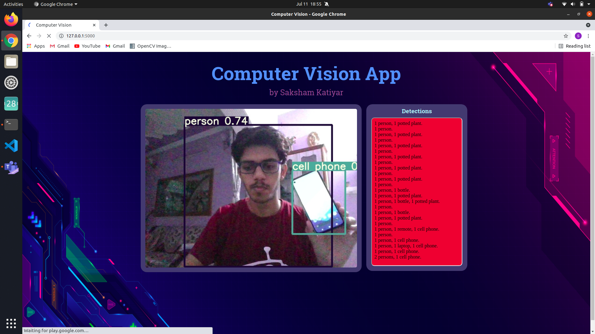

# Computer Vision (Web App)
This directory includes all the files needed for running the web app. The object detection and classification is done using YOLOv5 (https://github.com/ultralytics/yolov5).
The stream taken from the webcam is processed for object detection and the output is shown with bounding boxes (with labels). Besides the output stream, the number and type of objects is listed. The background of this window turns red if any cell-phone is detected in the video stream.

## Instructions to run it locally:
* Clone the repo and move to this directory 
`git clone https://github.com/Saksham-Katiyar/Computer-Vision-based-Web-App.git` 
`cd Computer-Vision-based-Web-App/Web_App`
* Set the python environment and download the required python libraries 
`source app_env/bin/activate` 
`pip install -r requirements.txt`
* Run the detection app 
`python3 detect.py`
* Copy the url shown in the terminal and open it in a browser. The output will look like the screenshot attched below. 

## Improvements
This is not the final output of the project and there are lots of improvements to be done including: 
1. Implementing an on/off button on the web page that switches the output stream.
2. Adding features like storing the output in a well-organised file.